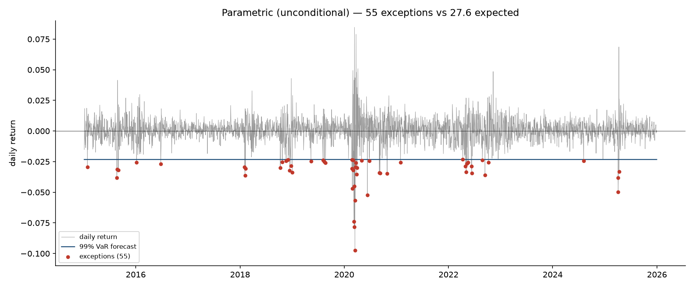
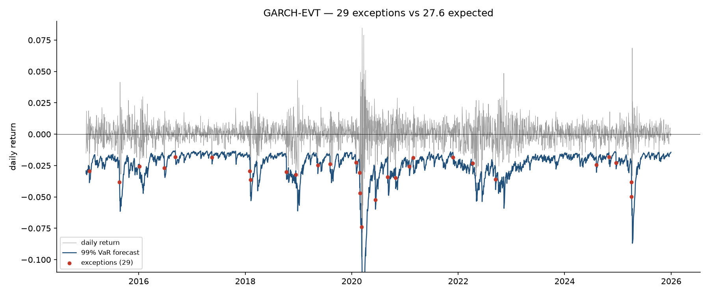

# Portfolio VaR Engine

A multi-asset Value at Risk engine comparing unconditional, conditional, and
extreme-value approaches, evaluated by exception backtesting over eleven years
of data.

**Headline result:** unconditional parametric VaR breached twice as often as it
should have, with more than half its failures concentrated in two years.
Adding conditional volatility fixed the clustering; adding an extreme-value
tail model fixed the rate. The final model breached 1.05% of the time against a
1% design target.

---

## Why this exists

Value at Risk is a single number that hides three separate modelling choices:
the distributional assumption, the volatility estimate, and the tail model.
This project implements four approaches on the same portfolio and measures
where each one fails — not to find a winner, but to isolate which assumption
is responsible for which failure.

## Portfolio and data

Six assets, daily adjusted closes from Yahoo Finance, 2015-01-02 to
2025-12-30 (2,765 trading days, 2,764 returns).

| Ticker | Weight | Sector |
|---|---|---|
| AAPL | 20% | Technology |
| MSFT | 20% | Technology |
| JPM | 15% | Financials |
| XOM | 15% | Energy |
| JNJ | 15% | Healthcare |
| TLT | 15% | Long-duration Treasuries |

Chosen for correlation structure rather than performance — TLT typically moves
against the equity sleeve, so the covariance matrix has meaningful off-diagonal
content.

**Returns.** Log returns. Additive over time, which makes square-root-of-time
scaling internally consistent, and closer to normally distributed than simple
returns. The cost is that portfolio log return is not exactly the weighted sum
of asset log returns; at daily frequency the error is second-order.

**Missing data.** Dates where any asset lacks a price are dropped rather than
forward-filled. Forward-filling manufactures an artificial 0% return, biasing
volatility downward — the wrong direction of error for a risk model.

---

## Findings




### 1. The normal distribution fails badly on this portfolio

| Statistic | Value | Normal |
|---|---|---|
| Mean daily return | 0.0551% | — |
| Daily volatility | 0.9992% | — |
| Annualised volatility | 15.86% | — |
| Skewness | −0.4182 | 0 |
| **Excess kurtosis** | **12.41** | **0** |
| Worst day | −9.76% (2020-03-16) | — |

Measured against full-sample volatility, the worst day sits 9.8 standard
deviations below the mean — an event a normal distribution assigns a
probability on the order of 10⁻²². It happened once in ten years.

### 2. Most of that fat tail is volatility clustering, not a fat distribution

Standardising returns by GARCH(1,1) conditional volatility (`z = u / σ`):

| Series | Excess kurtosis |
|---|---|
| Raw returns | 12.41 |
| GARCH-standardised residuals | 1.98 |

Conditional volatility modelling removes roughly 84% of the excess kurtosis.
What looked like a fat-tailed distribution was largely time-varying variance.

Measured against the volatility prevailing at the time, 16 March 2020 was an
unremarkable 1.95-sigma day. The genuinely unexpected day was **3 September
2020** at −5.23 sigma: a moderate loss during a calm regime, which does not
appear in the ten largest raw losses. An unconditional model never surfaces it.

The residual 1.98 excess kurtosis is the part GARCH cannot explain — the
*conditional heavy tails* property documented in Cont (2001) — and it is what
motivates the EVT layer.

### 3. GARCH(1,1) parameters

Fitted by maximum likelihood on the full sample:

| Parameter | Estimate |
|---|---|
| ω | 0.028358 |
| α | 0.129107 |
| β | 0.837285 |
| α + β | 0.966392 |

Stationary (α + β < 1). Implied long-run volatility
`sqrt(ω / (1 − α − β)) = 0.919%` daily against a sample standard deviation of
0.999% — close agreement. Shock half-life `ln(0.5)/ln(0.966) ≈ 20` trading days.

### 4. EVT tail fit and threshold stability

Generalised Pareto Distribution fitted to standardised-residual exceedances by
peaks-over-threshold.

| Threshold | n exceedances | u | ξ (shape) | z (99%) |
|---|---|---|---|---|
| 90.0th pct | 277 | 1.101 | 0.0573 | 2.7889 |
| 92.5th pct | 208 | 1.310 | 0.0933 | 2.7695 |
| **95.0th pct** | **139** | **1.579** | **0.0693** | **2.7829** |
| 97.5th pct | 70 | 2.087 | 0.2925 | 2.6931 |

ξ > 0 confirms a heavy tail, and is stable between 0.057 and 0.093 for
thresholds from the 90th to 95th percentile. The 97.5th percentile fit is
excluded: 70 observations is too few for a stable shape estimate.

Notably the **99% quantile is far more stable than the shape parameter** —
ξ varies by a factor of five across thresholds while z varies by 3.5%. The VaR
output is robust to a choice the intermediate parameter is sensitive to.

At the selected threshold the EVT 99% quantile is **2.78 sigma against 2.33
under normality** — a 19.6% wider tail.

### 5. Point-in-time VaR comparison

1-day 99% VaR as of 2025-12-30:

| Model | VaR | Note |
|---|---|---|
| Parametric (normal, unconditional σ) | 2.324% | |
| Historical simulation | 2.968% | 28% above parametric |
| Historical Expected Shortfall | 4.184% | 41% above historical VaR |
| GARCH-EVT (conditional σ) | 1.439% | conditional σ was ~half its long-run level |

Historical simulation exceeds parametric by 28% — the empirical 1st percentile
sits well beyond where normality places it. ES exceeds VaR by 41%, against
roughly 15% under a normal distribution: the tail is deeper as well as wider.

The GARCH-EVT figure is lower only because it is conditional. Volatility on
that date was roughly half the ten-year average, so a model that tracks
volatility quotes a smaller number. The like-for-like comparison is the
quantile, not the VaR: 2.78 sigma versus 2.33.

### 6. Backtest — the main result

Exception counting over 2,764 days at 99% confidence. Expected: **27.6**.

| Model | Exceptions | Rate | 2020 | 2022 |
|---|---|---|---|---|
| Parametric (unconditional) | 55 | 1.99% | 20 | 10 |
| GARCH (normal quantile) | 38 | 1.37% | 8 | 3 |
| **GARCH-EVT** | **29** | **1.05%** | 7 | 2 |

Full year-by-year distribution:

| Year | Parametric | GARCH | GARCH-EVT |
|---|---|---|---|
| 2015 | 4 | 3 | 2 |
| 2016 | 2 | 3 | 3 |
| 2017 | 0 | 1 | 1 |
| 2018 | 9 | 6 | 4 |
| 2019 | 5 | 3 | 2 |
| 2020 | **20** | 8 | 7 |
| 2021 | 1 | 4 | 3 |
| 2022 | **10** | 3 | 2 |
| 2023 | 0 | 0 | 0 |
| 2024 | 1 | 4 | 3 |
| 2025 | 3 | 3 | 2 |

**Each model fixes a distinct, identifiable failure.**

Parametric VaR fails on both counts. The rate is double its target, and 30 of
its 55 exceptions fall in 2020 and 2022 alone. Twenty exceptions in 2020 would
place it in Basel's red zone. The clustering is the more serious failure: it
means the model is not reacting to volatility at all, quoting the same 2.324%
in February 2020 as in March 2020 when realised volatility had risen six-fold.

Conditional volatility fixes the clustering. GARCH cut 2020 from 20 exceptions
to 8 and 2022 from 10 to 3, leaving a distribution with no dominant year. But
the overall rate remains 1.37% — too high — because GARCH still assumes normal
innovations, and the standardised residuals are not normal.

The EVT layer fixes the rate. Replacing the normal quantile of 2.326 with the
fitted 2.783 brings the count to 29 against 27.6 expected, a rate of 1.05%.

---

## Models implemented

| Model | Status |
|---|---|
| EWMA volatility (λ = 0.94) | Complete |
| GARCH(1,1) conditional volatility | Complete |
| Parametric (variance-covariance) VaR | Complete |
| Historical simulation VaR | Complete |
| Historical Expected Shortfall | Complete |
| GARCH-EVT (McNeil–Frey) with threshold stability | Complete |
| Exception counting | Complete |
| Kupiec POF test | In progress |
| Christoffersen independence test | Planned |
| Monte Carlo VaR (Cholesky-correlated) | Planned |
| Marginal and component VaR | Planned |

EWMA is seeded with the sample variance of the first 30 returns. At λ = 0.94
the seed's weight decays below 0.2% within 100 observations.

---

## Limitations

- **GARCH and GPD parameters are estimated on the full sample.** The
  conditional volatility for March 2020 reflects parameters fitted partly on
  2024 data. This is look-ahead bias; a production backtest would refit on an
  expanding window, and the in-sample fit therefore flatters all conditional
  models.
- **The EVT tail parameters are held fixed across the backtest.** Only σ varies
  by day. A live implementation would refit the GPD on a rolling window.
- **Fixed weights** assume daily rebalancing to target with no transaction costs.
- **Equities and Treasuries only** — no derivatives, so no non-linear payoffs.
- **Sample covariance is unshrunk.** Acceptable at six assets and 2,764
  observations; noisy for larger portfolios.
- **Square-root-of-time scaling** assumes iid returns. Neither independence nor
  identical distribution holds. GARCH provides a mean-reverting term structure
  that is more defensible at multi-day horizons.

---

## Structure

```
var-engine/
├── config.yaml           portfolio weights, model and backtest parameters
├── src/
│   ├── data.py           download, cleaning, returns, portfolio aggregation
│   ├── var_models.py     VaR methods and volatility models
│   ├── backtest.py       exception counting, Kupiec, Basel zones
│   └── plots.py          distribution, exception timeline, model comparison
├── tests/                pytest unit tests
└── run.py                end-to-end pipeline
```

## Running it

```bash
python -m venv .venv && source .venv/bin/activate
pip install -r requirements.txt
python -m src.data          # verify the data layer
python run.py               # full pipeline
```

---

## References

- Hull, J. *Risk Management and Financial Institutions*, 6th ed., Wiley, 2023.
- Cont, R. "Empirical properties of asset returns: stylized facts and
  statistical issues." *Quantitative Finance* 1 (2001): 223–236.
- Kupiec, P. "Techniques for verifying the accuracy of risk measurement
  models." *Journal of Derivatives* 3 (1995): 73–84.
- McNeil, A. and Frey, R. "Estimation of tail-related risk measures for
  heteroscedastic financial time series: an extreme value approach."
  *Journal of Empirical Finance* 7 (2000): 271–300.